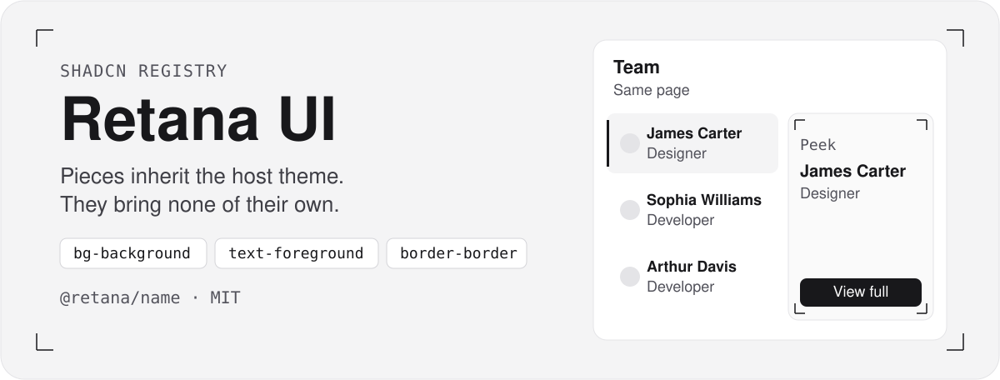
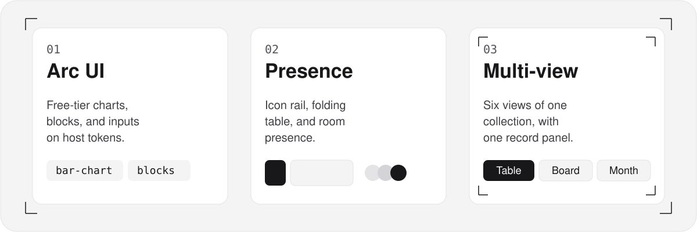
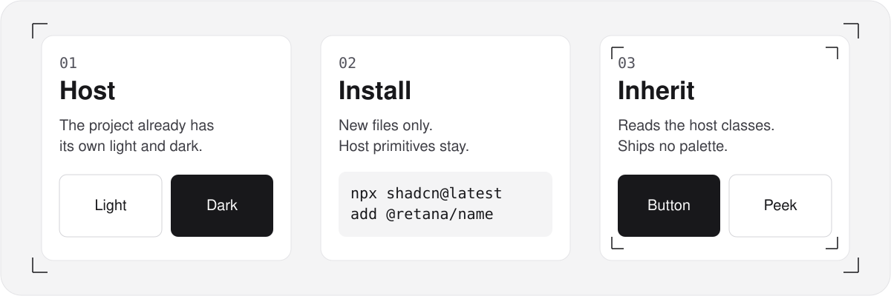

# Retana UI

<p align="center">
  <picture>
    <source media="(prefers-color-scheme: dark)" srcset="./.github/assets/hero-dark.svg">
    
  </picture>
</p>

A [shadcn/ui](https://ui.shadcn.com) registry by [Eduardo Retana](https://eduardoretana.com). Each piece installs into a host that already has shadcn, uses that host's semantic classes and primitives, and ships no theme of its own. Dark mode comes from the host.

Catalog demos are written in Spanish. Labels on the pieces are props.

## What's in the catalog

<p align="center">
  <picture>
    <source media="(prefers-color-scheme: dark)" srcset="./.github/assets/families-dark.svg">
    
  </picture>
</p>

The index at the bottom is generated from `registry.json`. These groups are the newest.

**Arc UI free tier.** Charts, page blocks, inputs, and actions adapted from [Arc UI](https://github.com/kuratlielia/arc-library) by Elia Kuratli (MIT). This registry includes the free tier. Adapted motion depends on the `motion` package and is skipped when the reader prefers reduced motion. A few older pieces gained optional behaviors from that same tier: reactions on `chat-message`, line collapse on `code-block`, swatches and EyeDropper on `color-picker`, chip overflow on `multi-select`, upload progress on `magnetic-dropzone`, pause and play on `logo-marquee`, and focus options on `otp-field`.

**Rail, adaptive table, and presence.** `rail-sidebar` is an icon rail plus a section panel, built on the host sidebar. `adaptive-table` drops, folds, and stretches columns to the container width. The presence kit is `presence`, `presence-liveblocks`, `presence-supabase`, `presence-avatars`, `live-cursors`, `typing-indicator`, and `presence-outline`. UI pieces read one provider, so the same avatars and cursors work with the in-memory adapter, Liveblocks, or Supabase Realtime. Liveblocks wiring uses the Apache-2.0 client packages. Setup notes ship in [`registry/lib/presence/README.md`](registry/lib/presence/README.md).

**Multi-view.** `multi-view` shows one collection as `view-table`, `view-kanban`, `view-calendar`, `view-timeline`, `view-grouped-list`, and `view-gallery`, with `record-properties` in the record panel. `multi-view-core` and `use-multi-view` hold the field schema and the view state. Pass records in. Saves go through host callbacks and roll back when a callback rejects. Wiring for Supabase and a plain REST API is in [`registry/lib/multi-view/README.md`](registry/lib/multi-view/README.md). `view-customizer` and the exported `view-switcher` choose which of those views stay on. One view hides the pill. Two or more show it, and the neighbouring add button slides with the same spring as the segmented control. The choice can be remembered per project or globally. Reduced motion skips the slide.

**Inbox.** `support-inbox`, `ticket-desk`, and `notification-inbox` are three desks built from `inbox-list`, `reply-composer`, `ticket-properties`, and `contact-panel`. Reply and internal note share one composer. A note uses the host accent. Send is Cmd or Ctrl+Enter. The desks take records through props. The live demos use Estudio Bruma, a fictional ceramics studio. No third-party inbox source, copy, or assets were copied.

**Review desk.** `review-desk` is one configurable desk for a record review: overview, collection, summary, documents, a finding, and a package. Nav, statuses, findings, and the final action come from a typed config (`defineReviewDesk`). The period switch reuses `segmented-control`. The notes tab reuses `reply-composer`. Three fictional presets ship in the demo: a solar workshop, a sales pipeline, and a credit file. No third-party source, copy, or assets were copied.

**Layouts.** [`magnetic-bento`](registry/ui/magnetic-bento.tsx) is a bento grid with one shared highlight. The active card sets `anchor-name` and the highlight uses `position-anchor` with `inset: anchor(inside)`, so the four edges stretch between cards of different sizes. Browsers where `CSS.supports("anchor-name: --x")` is false measure the active card instead. The technique idea is from [jh3yy](https://x.com/jh3yy/status/2105823926978814273). The cards in this registry are original.

**Verification and notices.** [`two-factor-card`](registry/ui/two-factor-card.tsx) is a one-time-code card on the `input-otp` primitive: countdown, verify, alternate methods, and a success handoff. [`otp-field`](registry/ui/otp-field.tsx) is the field alone when the screen already has its own frame. [`notification-stack`](registry/ui/notification-stack.tsx) is a depth stack that advances when the front card is dismissed. [`toast-stack`](registry/ui/toast-stack.tsx) is for short results at the edge, [`notification-center`](registry/blocks/notification-center.tsx) keeps a grouped list with read state, and [`card-stack`](registry/ui/card-stack.tsx) is a left-or-right triage deck. The two new cards take visual inspiration from Design & Code With AV Facebook reels. No code from those reels was used.

## How a piece stays on the host theme

<p align="center">
  <picture>
    <source media="(prefers-color-scheme: dark)" srcset="./.github/assets/mechanism-dark.svg">
    
  </picture>
</p>

The catalog can preview items because its own theme lives in `app/globals.css` and `app/layout.tsx`. Nothing under `registry/` imports that theme. `pnpm registry:build` rejects hex colors, `rgb` / `oklch`, Tailwind palette classes, and `cssVars` inside `registry/`.

When the CLI asks to overwrite a primitive the host already has (`button`, `scroll-area`, `sidebar`, and the rest), answer **no**. Only the new item's files should be written.

## Which piece should I use

Names that sit near each other do different jobs. Install the row that matches the screen.

### Tables

| Piece | Use it for |
| --- | --- |
| [`data-table`](registry/ui/data-table.tsx) | A bookings-style admin list: tabs, search, filters, sorting, column visibility, multi-select bulk actions, CSV export, and a detail side panel. |
| [`crm-table`](registry/ui/crm-table.tsx) | A fixed contact layout: avatar and name, status, stage, owner, and last activity. `crmColumnDefs()` can be passed to `AdminDataTable` when `data-table` is installed. |
| [`crm-companies-table`](registry/ui/crm-companies-table.tsx) | A company book: logo, status, owner, pipeline value, score, and an activity sparkline. Sort, select, sticky header, paged footer, and CSV. |
| [`adaptive-table`](registry/ui/adaptive-table.tsx) | A grouped table in a narrow panel. Columns declare a priority, drop when the container is tight, and fold into a neighbor. |
| [`view-table`](registry/ui/view-table.tsx) | Rows from a field schema, with checkbox selection and per-type cells, when those same rows also appear in the other views. |

`view-grouped-list` is collapsible groups of compact rows, including a progress ring. `view-gallery` is cards with an optional cover and quick filter chips. `view-calendar` is a month grid for one date field.

### Boards

| Piece | Use it for |
| --- | --- |
| [`sortable-board`](registry/ui/sortable-board.tsx) | The homepage project board: category tabs and counts, search, list or grid, and a homepage switch per row. |
| [`view-kanban`](registry/ui/view-kanban.tsx) | Status or select columns over a field schema, with counts, sums, drag, a keyboard sensor, and a Move to menu. |

### Time

| Piece | Use it for |
| --- | --- |
| [`timeline`](registry/ui/timeline.tsx) | An activity feed, newest first, grouped by day. |
| [`view-timeline`](registry/ui/view-timeline.tsx) | A horizontal schedule with a start and an end, zoom, a today line, and keyboard move or resize. |

### Editing a record

| Piece | Use it for |
| --- | --- |
| [`inline-edit`](registry/ui/inline-edit.tsx) | One string in place. The text becomes a field without moving. |
| [`record-properties`](registry/ui/record-properties.tsx) | A whole schema of property rows, including inside `layered-panel`. Enter commits. Escape cancels. |

### People

| Piece | Use it for |
| --- | --- |
| [`avatar-group`](registry/ui/avatar-group.tsx) | A static stack of people, with an overflow count. |
| [`presence-avatars`](registry/ui/presence-avatars.tsx) | People currently in a presence room, with a live dot, tooltips, and an optional single avatar for every agent. It reads `PresenceProvider`. |

### Layouts

| Piece | Use it for |
| --- | --- |
| [`magnetic-bento`](registry/ui/magnetic-bento.tsx) | Mixed column and row spans with one highlight that glides between cards. Hover, focus, and tap move it, and it stays on the last card. |
| [`blog-grid`](registry/blocks/blog-grid.tsx) | A page of posts. |
| [`card-stack`](registry/ui/card-stack.tsx) | A triage deck you flick left or right. For notices in a depth stack, use `notification-stack`. |
| [`radio-cards`](registry/ui/radio-cards.tsx) | One choice among option cards, with arrow keys. |
| [`view-gallery`](registry/ui/view-gallery.tsx) | Schema records as cards, inside multi-view. |

### Verification

| Piece | Use it for |
| --- | --- |
| [`otp-field`](registry/ui/otp-field.tsx) | The code field alone: digits, an error, a success line, and a resend cooldown. |
| [`two-factor-card`](registry/ui/two-factor-card.tsx) | The whole verification card: countdown, verify, alternate methods, and a success handoff. Same `input-otp` primitive. |

### Notices

| Piece | Use it for |
| --- | --- |
| [`toast-stack`](registry/ui/toast-stack.tsx) | Short results at the edge of the screen. |
| [`notification-center`](registry/blocks/notification-center.tsx) | A grouped list that keeps read state. |
| [`crm-notifications`](registry/ui/crm-notifications.tsx) | A short header popover of company notices. |
| [`notification-stack`](registry/ui/notification-stack.tsx) | A depth stack. Dismiss the front card and the next one steps forward. |
| [`card-stack`](registry/ui/card-stack.tsx) | A triage deck you flick left or right, one decision at a time. |

### Proposals

| Piece | Use it for |
| --- | --- |
| [`proposal-builder`](registry/blocks/proposal-builder.tsx) | The whole flow: shell, dashboard, intake, deal tabs, and send. |
| [`proposal-shell`](registry/blocks/proposal-shell.tsx) | Grouped sidebar, search, unread bell, period, and the step's primary action. |
| [`proposal-dashboard`](registry/blocks/proposal-dashboard.tsx) | Greeting, metric cards, action rows, hours chart, confidence gauge, and activity. |
| [`proposal-workspace`](registry/ui/proposal-workspace.tsx) | Deal header and a tab bar whose underline slides. |
| [`proposal-discovery`](registry/ui/proposal-discovery.tsx) | Call notes, timestamps, quotes, and a waveform. |
| [`proposal-estimate`](registry/ui/proposal-estimate.tsx) | Phase hours against history, a two-week load, and a price receipt. |
| [`proposal-document`](registry/ui/proposal-document.tsx) | Reorderable sections, a paper preview, and a pre-flight list. |

The other steps are `proposal-opportunity`, `proposal-analyze`, `proposal-clarify`, `proposal-scope`, `proposal-similar`, `proposal-risks`, `proposal-sow`, `proposal-activity`, and `proposal-send`. They are a clean-room reading of a discovery-to-statement-of-work demo. No product names or sample copy were copied. The live walkthrough is [`/examples/proposal-builder`](/examples/proposal-builder).

### Inbox

Clean-room desks. Pass the records in. The Estudio Bruma demos are fictional.

| Piece | Use it for |
| --- | --- |
| [`support-inbox`](registry/blocks/support-inbox.tsx) | Folders, a conversation list, a thread, and a contact panel with a copilot slot. |
| [`ticket-desk`](registry/blocks/ticket-desk.tsx) | A ticket list, a thread, properties, and create or edit through `entity-form`. |
| [`notification-inbox`](registry/blocks/notification-inbox.tsx) | Tabs with counts, mark all read, snooze, archive, and a comment thread. |
| [`reply-composer`](registry/ui/reply-composer.tsx) | Reply and internal note, suggestion chips, and Cmd or Ctrl+Enter to send. |
| [`inbox-list`](registry/ui/inbox-list.tsx) | Searchable rows with presence, preview, time, and an unread count. |
| [`ticket-properties`](registry/ui/ticket-properties.tsx) | Status, priority, an overdue due date, SLA, tags, and read-only metadata. |
| [`contact-panel`](registry/ui/contact-panel.tsx) | Details and Copilot tabs. Copilot is a slot. |
| [`view-customizer`](registry/ui/view-customizer.tsx) | Multi-select view tiles, plus the animated `view-switcher` pill. |

### Review desk

One block, three presets. Domain words stay in the config.

| Piece | Use it for |
| --- | --- |
| [`review-desk`](registry/blocks/review-desk.tsx) | The desk. Pass nav, records, findings, and the final action. `defineReviewDesk` builds a preset. |
| [`record-card`](registry/ui/record-card.tsx) | A hero, media, or tile card. The cover is a seeded wash. |
| [`score-card`](registry/ui/score-card.tsx) | A score and a tick gauge. The number comes from the config. |
| [`issue-list`](registry/ui/issue-list.tsx) | Findings with severity. Arrow keys move the selection. |
| [`issue-detail`](registry/ui/issue-detail.tsx) | One finding, the comparison, and the approval. |
| [`document-list`](registry/ui/document-list.tsx) | Documents as a review list or a checklist. |
| [`status-pill`](registry/ui/status-pill.tsx) | A tone, a dot, and a label you pass in. |

The overview period switch reuses `segmented-control`. The notes tab reuses `reply-composer`. The live presets are [`/examples/review-desk`](/examples/review-desk).

`admin-shell` is the collapsible admin sidebar with breadcrumbs and a command palette. `rail-sidebar` is the two-layer app sidebar: an icon rail for sections and a panel for that section's links. `multi-view` is the block that switches the six views and opens the record panel.

### Sales CRM

Clean-room company book. The reference has no license, so nothing was copied. Install [`crm-dashboard`](registry/blocks/crm-dashboard.tsx) for the page, or one piece:

| Piece | Use it for |
| --- | --- |
| [`crm-dashboard`](registry/blocks/crm-dashboard.tsx) | The page: sidebar, header, and the pieces below, with in-memory Spanish sample data. |
| [`crm-companies-table`](registry/ui/crm-companies-table.tsx) | The company table. `crm-table` stays the fixed contact layout. |
| [`crm-toolbar`](registry/ui/crm-toolbar.tsx) | Search, segments, and multi-select facets. Narrow containers use a sheet. |
| [`crm-company-detail`](registry/ui/crm-company-detail.tsx) | The side panel: score, health meter, activity trend, and sections. |
| [`crm-command-menu`](registry/ui/crm-command-menu.tsx) | Cmd-K search with a compact result table. `command-palette` stays the command list. |
| [`crm-new-company-dialog`](registry/ui/crm-new-company-dialog.tsx) | Create form with a logo, sections, and validation. |
| [`crm-notifications`](registry/ui/crm-notifications.tsx) | Header popover. `notification-center` is the fuller inbox. |

### Micro-interactions

Sound, haptics, squircles, animated theme icons, and a few expressive controls. They inherit the host tokens. Sound and haptics can be muted, and nothing plays before a gesture.

| Piece | Use it for |
| --- | --- |
| [`ui-sounds`](registry/ui/ui-sounds.tsx) | Fourteen synthesized cues (cuelume). `press-sound` stays the tap, tick, and pop facade. |
| [`theme-toggle-icons`](registry/ui/theme-toggle-icons.tsx) | Fourteen animated theme icons. Pass `icon` to [`theme-switch`](registry/ui/theme-switch.tsx). |
| [`squircle`](registry/ui/squircle.tsx) | `corner-shape: squircle` where the browser has it, otherwise a clip-path. |
| [`morph-dialog`](registry/ui/morph-dialog.tsx) | A trigger that grows into a modal dialog. |
| [`morph-popover`](registry/ui/morph-popover.tsx) | A trigger surface that grows into a non-modal panel. |
| [`shortcut-button`](registry/ui/shortcut-button.tsx) | A button whose keycaps depress for a shortcut. |
| [`spotlight-button`](registry/ui/spotlight-button.tsx) | A cursor spotlight on the host button. |
| [`slide-to-confirm`](registry/ui/slide-to-confirm.tsx) | Slide or use the arrow keys past a threshold. |
| [`haptics`](registry/ui/haptics.tsx) | `navigator.vibrate`, muted by choice, otherwise a no-op. |
| [`motion-preference`](registry/ui/motion-preference.tsx) | System, reduced, or full motion. |
| [`use-feedback`](registry/hooks/use-feedback.ts) | One intent for sound, haptic, and an optional motion hint. |

### Animaciones

Scroll and motion primitives. They inherit the host tokens and follow [`motion-preference`](registry/ui/motion-preference.tsx). The glossary page is [`/examples/animations`](/examples/animations). The six names are industry vocabulary. The demos are original. Motion UI and Motion+ are not in this registry.

| Piece | Use it for |
| --- | --- |
| [`use-scroll-progress`](registry/hooks/use-scroll-progress.ts) | Scroll position as 0–1, for the window or a chosen element. |
| [`scroll-progress`](registry/ui/scroll-progress.tsx) | A reading bar bound to that position. |
| [`reveal-on-scroll`](registry/ui/reveal-on-scroll.tsx) | Fade, slide, or scale once, when the element enters. |
| [`stagger-reveal`](registry/ui/stagger-reveal.tsx) | The same entrance, staggered across children. |
| [`scroll-snap-rail`](registry/ui/scroll-snap-rail.tsx) | Native scroll-snap for sections or cards. |
| [`sticky-section-list`](registry/ui/sticky-section-list.tsx) | Group headers that stick until the next group. |
| [`parallax-layers`](registry/ui/parallax-layers.tsx) | Layers that travel at different speeds. Still when motion is reduced. |
| [`horizontal-scroll-rail`](registry/ui/horizontal-scroll-rail.tsx) | Vertical scroll drives a horizontal rail. Native scroll when motion is reduced or the viewport is narrow. |

## Install

Register the namespace once in the host `components.json`. Pin `@retana` to a commit. A branch name would float.

```json
{
  "registries": {
    "@retana": {
      "url": "https://raw.githubusercontent.com/eduardoretana/retana-ui/047eccb2a4589be8b30babfa2c9a57beaf4d8bfc/public/r/{name}.json"
    }
  }
}
```

`047eccb2a4589be8b30babfa2c9a57beaf4d8bfc` is `CPL` when this page was written. Replace that SHA with the commit the host should install.

```bash
npx shadcn@latest add @retana/layered-panel
```

The same file, with no namespace:

```bash
npx shadcn@latest add https://raw.githubusercontent.com/eduardoretana/retana-ui/047eccb2a4589be8b30babfa2c9a57beaf4d8bfc/public/r/layered-panel.json
```

The public catalog host is not chosen yet. `https://<your-deployment>` does not pin a SHA. It stays a placeholder, on this page and on `/docs`, for a deployment you control.

Omit `headers` when the deployment is public and `REGISTRY_TOKEN` is unset. When the deployment gates `/r/*`, add the header. The shadcn CLI substitutes `${REGISTRY_TOKEN}` from the host's `.env.local`.

```json
{
  "registries": {
    "@retana": {
      "url": "https://<your-deployment>/r/{name}.json",
      "headers": {
        "Authorization": "Bearer ${REGISTRY_TOKEN}"
      }
    }
  }
}
```

The same namespace can be registered from the CLI:

```bash
npx shadcn@latest registry add @retana=https://<your-deployment>/r/{name}.json
```

A single file, with no namespace:

```bash
npx shadcn@latest add https://<your-deployment>/r/<name>.json
```

You can also copy the files listed for an item under `registry/`. Fix imports only if your aliases differ. `registry.json` is the source of truth for the catalog index (`/`) and for `/items/[name]`. Each item page shows the description, the install command, and the notes from that item's `docs` field. Install notes for the running catalog are on `/docs`.

This catalog is a Next.js app (App Router) on Tailwind v4 and shadcn's Radix Nova style. The optional URL hook in `layered-panel` is the registry file that imports `next/navigation`. Skip that file if you do not want the query string.

## Publishing

Import this repository in Vercel and set the production branch to `CPL`. To serve `/r/*` with no token, set `REGISTRY_PUBLIC=true` and leave `REGISTRY_TOKEN` unset.

`proxy.ts` checks `REGISTRY_TOKEN` first. If it is set, `/r/*` requires `Authorization: Bearer <token>` in production and in development, and `REGISTRY_PUBLIC` is ignored. If no token is set, production serves `/r/*` only when `REGISTRY_PUBLIC=true` and otherwise returns 401. Development serves `/r/*` with no token.

## One piece, end to end

**Layered panel** opens a peek sheet on the right and can expand in place. The page behind it does not change route, so the table keeps its scroll position.

```tsx
"use client"

import { LayeredPanel } from "@/components/ui/layered-panel"

export function Members({
  open,
  setOpen,
  mode,
  setMode,
}: {
  open: boolean
  setOpen: (open: boolean) => void
  mode: "peek" | "full"
  setMode: (mode: "peek" | "full") => void
}) {
  return (
    <LayeredPanel
      open={open}
      onOpenChange={setOpen}
      mode={mode}
      onModeChange={setMode}
      title="James Carter"
    >
      <LayeredPanel.Peek>Short summary.</LayeredPanel.Peek>
      <LayeredPanel.Full>The long record. The route stays the same.</LayeredPanel.Full>
    </LayeredPanel>
  )
}
```

```bash
npx shadcn@latest add @retana/layered-panel
```

Props, slots, and the URL hook are in [`registry/ui/layered-panel.tsx`](registry/ui/layered-panel.tsx). For a table beside that panel, use the guide above.

## Catalog

<!-- CATALOG:START -->

`272` items are in `registry.json` on this branch: `226` components, `35` blocks, `5` hooks, and `6` libraries. A name links to its source file.
Run `pnpm readme:catalog` to refresh this list.

Install any registered item with `npx shadcn@latest add @retana/<name>`.

### Detail

- [`layered-panel`](registry/ui/layered-panel.tsx) · block — Right-hand peek panel that expands in place to a two-column detail view. No route change. Optional Next.js URL sync keeps Back working: full collapses to peek, then closes. Ships no theme, cssVars, or global CSS — it uses the host project's shadcn tokens and primitives. Install: `npx shadcn@latest add @retana/layered-panel`.

### Chat and agents

- [`chat-message`](registry/ui/chat-message.tsx) · ui — Message bubble for a person or an assistant, with avatar, time, sending and error states, and copy, retry, and regenerate actions. Install: `npx shadcn@latest add @retana/chat-message`.
- [`message-list`](registry/ui/message-list.tsx) · ui — Scroll container that follows new messages until the reader moves up, then offers a control to jump back to the latest one. Install: `npx shadcn@latest add @retana/message-list`.
- [`chat-composer`](registry/ui/chat-composer.tsx) · ui — Growing textarea that sends on Enter, inserts a newline on Shift+Enter, accepts attachments, swaps in a stop button while generating, and leaves a slot for a model picker. Install: `npx shadcn@latest add @retana/chat-composer`.
- [`streaming-text`](registry/ui/streaming-text.tsx) · ui — Renders text as it arrives, with a caret and a short fade-in, and supports basic markdown. Install: `npx shadcn@latest add @retana/streaming-text`.
- [`reasoning-steps`](registry/ui/reasoning-steps.tsx) · ui — Collapsible list of reasoning or tool steps with pending, active, done, and error states plus a duration. Install: `npx shadcn@latest add @retana/reasoning-steps`.
- [`task-list`](registry/ui/task-list.tsx) · ui — Agent checklist with a progress bar and optional toggling. Install: `npx shadcn@latest add @retana/task-list`.
- [`plan-card`](registry/ui/plan-card.tsx) · ui — Card for a proposed plan, with steps and approve, edit, and reject actions. Install: `npx shadcn@latest add @retana/plan-card`.
- [`question-card`](registry/ui/question-card.tsx) · ui — Agent question with single or multiple choices and an optional free-text answer. Install: `npx shadcn@latest add @retana/question-card`.
- [`inline-citation`](registry/ui/inline-citation.tsx) · ui — Numeric marker that reveals a source title, domain, and excerpt on hover or focus. Install: `npx shadcn@latest add @retana/inline-citation`.
- [`code-block`](registry/ui/code-block.tsx) · ui — Code block with token highlighting, a filename, copy, and line numbers. Install: `npx shadcn@latest add @retana/code-block`.
- [`file-diff`](registry/ui/file-diff.tsx) · ui — Unified diff with added and removed lines, and collapsible runs of unchanged lines. Install: `npx shadcn@latest add @retana/file-diff`.
- [`image-generation`](registry/ui/image-generation.tsx) · ui — Image frame that shows progress and a shimmer while generating, then reveals the result. Install: `npx shadcn@latest add @retana/image-generation`.
- [`ai-document`](registry/ui/ai-document.tsx) · ui — Document where an agent proposes highlighted edits the reader can accept or reject. Install: `npx shadcn@latest add @retana/ai-document`.
- [`suggestion-card`](registry/ui/suggestion-card.tsx) · ui — A system suggestion with confidence, facts, evidence, and confirm, change, or dismiss. Install: `npx shadcn@latest add @retana/suggestion-card`.

### Inbox

- [`reply-composer`](registry/ui/reply-composer.tsx) · ui — A reply box with Reply and Note modes, suggestion chips, attachment, emoji, and snippet slots, and send on Cmd or Ctrl+Enter. Install: `npx shadcn@latest add @retana/reply-composer`.
- [`inbox-list`](registry/ui/inbox-list.tsx) · ui — A searchable list of conversations, tickets, or notifications, with presence, preview, time, unread count, and an empty state. Install: `npx shadcn@latest add @retana/inbox-list`.
- [`ticket-properties`](registry/ui/ticket-properties.tsx) · ui — Status, priority, type, assignee, an overdue due date, SLA, tags, and read-only channel and date rows. Install: `npx shadcn@latest add @retana/ticket-properties`.
- [`contact-panel`](registry/ui/contact-panel.tsx) · ui — A side panel with Details and Copilot tabs, a contact card, editable fields, and collapsible sections. Install: `npx shadcn@latest add @retana/contact-panel`.
- [`view-customizer`](registry/ui/view-customizer.tsx) · ui — A popover of view tiles you can turn on and off, plus an animated switcher that appears once two views are enabled. Install: `npx shadcn@latest add @retana/view-customizer`.
- [`support-inbox`](registry/blocks/support-inbox.tsx) · block — A three-pane desk with folders, a conversation list, a reply thread, a contact panel, and a new-conversation form. Install: `npx shadcn@latest add @retana/support-inbox`.
- [`ticket-desk`](registry/blocks/ticket-desk.tsx) · block — A ticket list with a status filter, a thread, a properties panel, and dialogs to create, edit, or delete a ticket. Install: `npx shadcn@latest add @retana/ticket-desk`.
- [`notification-inbox`](registry/blocks/notification-inbox.tsx) · block — Notification tabs with counts, mark all read, snooze, archive, subscribe, a comment thread, and a properties column. Install: `npx shadcn@latest add @retana/notification-inbox`.

### Agents

- [`tool-call`](registry/ui/tool-call.tsx) · ui — One tool invocation with status, parameters, and a result or error. Install: `npx shadcn@latest add @retana/tool-call`.
- [`tool-approval`](registry/ui/tool-approval.tsx) · ui — A human gate before a tool runs, then a compact receipt. Install: `npx shadcn@latest add @retana/tool-approval`.
- [`message-branch`](registry/ui/message-branch.tsx) · ui — Page between regenerated variants of one reply. Install: `npx shadcn@latest add @retana/message-branch`.
- [`context-meter`](registry/ui/context-meter.tsx) · ui — A compact ring for a context window, with a breakdown on click. Install: `npx shadcn@latest add @retana/context-meter`.
- [`prompt-suggestions`](registry/ui/prompt-suggestions.tsx) · ui — A chip row that seeds a composer. Install: `npx shadcn@latest add @retana/prompt-suggestions`.
- [`source-list`](registry/ui/source-list.tsx) · ui — A collapsible list of numbered sources with excerpts. Install: `npx shadcn@latest add @retana/source-list`.
- [`message-error`](registry/ui/message-error.tsx) · ui — An inline failure under an assistant message, with retry. Install: `npx shadcn@latest add @retana/message-error`.
- [`system-notice`](registry/ui/system-notice.tsx) · ui — A slim in-thread status line, not a message bubble. Install: `npx shadcn@latest add @retana/system-notice`.
- [`slash-menu`](registry/ui/slash-menu.tsx) · ui — A slash command menu anchored to a textarea. Install: `npx shadcn@latest add @retana/slash-menu`.
- [`char-limit`](registry/ui/char-limit.tsx) · ui — A ring and counter that appears as an input nears its limit. Install: `npx shadcn@latest add @retana/char-limit`.
- [`parameter-slider`](registry/ui/parameter-slider.tsx) · ui — A labelled slider with a live value and a reset. Install: `npx shadcn@latest add @retana/parameter-slider`.
- [`confidence-badge`](registry/ui/confidence-badge.tsx) · ui — A 0–1 score as a badge, dial, or bar, with a text tier. Install: `npx shadcn@latest add @retana/confidence-badge`.
- [`voice-orb`](registry/ui/voice-orb.tsx) · ui — A state-driven voice visual that pauses when motion is reduced. Install: `npx shadcn@latest add @retana/voice-orb`.
- [`push-to-talk`](registry/ui/push-to-talk.tsx) · ui — Hold to record and release to send, with a toggle mode. Install: `npx shadcn@latest add @retana/push-to-talk`.
- [`audio-bars`](registry/ui/audio-bars.tsx) · ui — A row of activity bars driven by levels or an idle pulse. Install: `npx shadcn@latest add @retana/audio-bars`.
- [`audio-player`](registry/ui/audio-player.tsx) · ui — A compact player with a keyboard scrub bar. Install: `npx shadcn@latest add @retana/audio-player`.
- [`synced-transcript`](registry/ui/synced-transcript.tsx) · ui — A transcript that highlights the word at the current time. Install: `npx shadcn@latest add @retana/synced-transcript`.
- [`mic-select`](registry/ui/mic-select.tsx) · ui — A microphone or camera picker with permission states. Install: `npx shadcn@latest add @retana/mic-select`.
- [`use-device-capabilities`](registry/hooks/use-device-capabilities.ts) · hook — Browser capability, storage, and network hooks. Nothing is prompted or uploaded. Install: `npx shadcn@latest add @retana/use-device-capabilities`.
- [`capability-gate`](registry/ui/capability-gate.tsx) · ui — Renders children only after a feature check, without flashing the fallback. Install: `npx shadcn@latest add @retana/capability-gate`.
- [`capability-grid`](registry/ui/capability-grid.tsx) · ui — A local report of what this browser can do. Install: `npx shadcn@latest add @retana/capability-grid`.
- [`storage-meter`](registry/ui/storage-meter.tsx) · ui — Origin storage used, with a persistence request. Install: `npx shadcn@latest add @retana/storage-meter`.
- [`network-status`](registry/ui/network-status.tsx) · ui — An online or offline indicator, with an optional banner. Install: `npx shadcn@latest add @retana/network-status`.
- [`download-progress`](registry/ui/download-progress.tsx) · ui — A card for a large asset download, with speed and ETA. Install: `npx shadcn@latest add @retana/download-progress`.
- [`use-webcam`](registry/hooks/use-webcam.ts) · hook — Start, stop, and switch a camera stream. Tracks stop on unmount. Install: `npx shadcn@latest add @retana/use-webcam`.
- [`webcam-canvas`](registry/ui/webcam-canvas.tsx) · ui — A camera preview with a frame callback. The loop pauses offscreen. Install: `npx shadcn@latest add @retana/webcam-canvas`.
- [`detection-overlay`](registry/ui/detection-overlay.tsx) · ui — Labelled boxes over an image, with a legend. Install: `npx shadcn@latest add @retana/detection-overlay`.
- [`scan-overlay`](registry/ui/scan-overlay.tsx) · ui — A processing veil over an image, still when motion is reduced. Install: `npx shadcn@latest add @retana/scan-overlay`.
- [`entity-text`](registry/ui/entity-text.tsx) · ui — Inline highlights, masks, or redaction tokens for annotated spans. Install: `npx shadcn@latest add @retana/entity-text`.
- [`force-graph`](registry/ui/force-graph.tsx) · ui — An SVG node-link graph with a list fallback. Install: `npx shadcn@latest add @retana/force-graph`.
- [`confusion-matrix`](registry/ui/confusion-matrix.tsx) · ui — An N by N heat grid with counts or percents and a table fallback. Install: `npx shadcn@latest add @retana/confusion-matrix`.
- [`event-log`](registry/ui/event-log.tsx) · ui — A newest-first log with filters, pause, and expandable payloads. Install: `npx shadcn@latest add @retana/event-log`.
- [`error-boundary`](registry/ui/error-boundary.tsx) · ui — Catches a section error and offers try again. Install: `npx shadcn@latest add @retana/error-boundary`.
- [`passphrase-gate`](registry/ui/passphrase-gate.tsx) · ui — Create or unlock with a passphrase. The value is not stored. Install: `npx shadcn@latest add @retana/passphrase-gate`.
- [`artifact-panel`](registry/ui/artifact-panel.tsx) · ui — A docked canvas for generated content, with copy and download. Install: `npx shadcn@latest add @retana/artifact-panel`.
- [`language-pair`](registry/ui/language-pair.tsx) · ui — From and to language pickers with a swap. Install: `npx shadcn@latest add @retana/language-pair`.
- [`install-command`](registry/ui/install-command.tsx) · ui — Package-manager tabs that rewrite one install command and copy it. Install: `npx shadcn@latest add @retana/install-command`.
- [`demo-collage`](registry/blocks/demo-collage.tsx) · block — A grid of live mini demos that render when they scroll into view. Install: `npx shadcn@latest add @retana/demo-collage`.

### Forms

- [`otp-field`](registry/ui/otp-field.tsx) · ui — One-time code field on the input-otp primitive, with animated success and error states and a resend countdown. Install: `npx shadcn@latest add @retana/otp-field`.
- [`dissolve-input`](registry/ui/dissolve-input.tsx) · ui — Input whose text breaks into fading particles when it is submitted or cleared. Install: `npx shadcn@latest add @retana/dissolve-input`.
- [`multi-select`](registry/ui/multi-select.tsx) · ui — Multi-select with search, removable chips, and the option to create a new value. Install: `npx shadcn@latest add @retana/multi-select`.
- [`color-picker`](registry/ui/color-picker.tsx) · ui — Accessible color picker with a saturation and brightness field, hue, alpha, and a hex input. Install: `npx shadcn@latest add @retana/color-picker`.
- [`color-palette`](registry/ui/color-palette.tsx) · ui — Grid of color swatches that copy their value on click and confirm it. Install: `npx shadcn@latest add @retana/color-palette`.
- [`magnetic-dropzone`](registry/ui/magnetic-dropzone.tsx) · ui — Drop zone that leans toward the pointer, with a file list, progress, and type and size checks. Install: `npx shadcn@latest add @retana/magnetic-dropzone`.
- [`gooey-slider`](registry/ui/gooey-slider.tsx) · ui — Slider with an organic trail while dragging, built on the slider primitive. Install: `npx shadcn@latest add @retana/gooey-slider`.
- [`password-field`](registry/ui/password-field.tsx) · ui — A password field with a reveal control whose slash draws across the eye. Install: `npx shadcn@latest add @retana/password-field`.
- [`search-field`](registry/ui/search-field.tsx) · ui — A search field with a clear control that returns focus to the input. Install: `npx shadcn@latest add @retana/search-field`.
- [`segmented-control`](registry/ui/segmented-control.tsx) · ui — A small set of related choices. Arrow keys move the selection and the highlight glides. Install: `npx shadcn@latest add @retana/segmented-control`.
- [`number-field`](registry/ui/number-field.tsx) · ui — A bounded number with step buttons, keyboard steps, and an optional scrub. Install: `npx shadcn@latest add @retana/number-field`.
- [`tag-input`](registry/ui/tag-input.tsx) · ui — Turns short text values into removable tags. Install: `npx shadcn@latest add @retana/tag-input`.
- [`time-picker`](registry/ui/time-picker.tsx) · ui — Chooses a time with a listbox and arrow keys. Install: `npx shadcn@latest add @retana/time-picker`.
- [`inline-edit`](registry/ui/inline-edit.tsx) · ui — Renames in place: the text becomes a field without moving. Install: `npx shadcn@latest add @retana/inline-edit`.
- [`expanding-search`](registry/ui/expanding-search.tsx) · ui — An icon that morphs into a search field with results beneath it. Install: `npx shadcn@latest add @retana/expanding-search`.
- [`chip-group`](registry/ui/chip-group.tsx) · ui — Filters a few facets with chips that show the current pick. Install: `npx shadcn@latest add @retana/chip-group`.
- [`password-strength`](registry/ui/password-strength.tsx) · ui — Shows how strong a new password is while it is typed. Install: `npx shadcn@latest add @retana/password-strength`.
- [`signature-pad`](registry/ui/signature-pad.tsx) · ui — Ink that thins with speed, with undo, replay, and PNG or SVG export. Install: `npx shadcn@latest add @retana/signature-pad`.
- [`date-range-picker`](registry/ui/date-range-picker.tsx) · ui — A range picker with two months, presets, and keyboard selection. Install: `npx shadcn@latest add @retana/date-range-picker`.
- [`phone-input`](registry/ui/phone-input.tsx) · ui — A phone field with a country picker, formatting as you type, and E.164 output. Install: `npx shadcn@latest add @retana/phone-input`.
- [`shortcut-recorder`](registry/ui/shortcut-recorder.tsx) · ui — Records key combinations, warns on conflicts, and lists them in a cheatsheet. Install: `npx shadcn@latest add @retana/shortcut-recorder`.
- [`mention-input`](registry/ui/mention-input.tsx) · ui — A textarea where @people and #channels act as single tokens. Install: `npx shadcn@latest add @retana/mention-input`.
- [`rich-text-editor`](registry/ui/rich-text-editor.tsx) · ui — A lightweight editor with markdown shortcuts, a floating toolbar, a slash menu, and HTML and markdown output. Install: `npx shadcn@latest add @retana/rich-text-editor`.
- [`billing-toggle`](registry/ui/billing-toggle.tsx) · ui — A monthly and yearly switch with a savings badge and prices that roll. Install: `npx shadcn@latest add @retana/billing-toggle`.
- [`radio-cards`](registry/ui/radio-cards.tsx) · ui — Selectable option cards with one tab stop and arrow-key behavior. Install: `npx shadcn@latest add @retana/radio-cards`.
- [`two-factor-card`](registry/ui/two-factor-card.tsx) · ui — Verification card for a one-time code, with a countdown, alternate methods, and a success handoff. Install: `npx shadcn@latest add @retana/two-factor-card`.
- [`bug-report-form`](registry/ui/bug-report-form.tsx) · ui — Card form for a bug report: title, description, type chips, priority, environment, and a screenshot dropzone, with validation and submit states. Install: `npx shadcn@latest add @retana/bug-report-form`.
- [`proposal-opportunity`](registry/ui/proposal-opportunity.tsx) · ui — Client and project type, a pill source switch, an audio drop with duration, and an analyze action. The dialog scales from 0.95 with a fading overlay. Install: `npx shadcn@latest add @retana/proposal-opportunity`.
- [`proposal-clarify`](registry/ui/proposal-clarify.tsx) · ui — Question cards with segmented answers and a live impact: previous hours struck through, new hours, a delta, reasons, and price and timeline ranges. Install: `npx shadcn@latest add @retana/proposal-clarify`.
- [`proposal-scope`](registry/ui/proposal-scope.tsx) · ui — Phase accordions, circular task rows with hours and origin tags, a staggered entrance, an effort donut, and an exclusions list. Install: `npx shadcn@latest add @retana/proposal-scope`.
- [`proposal-estimate`](registry/ui/proposal-estimate.tsx) · ui — Phase table with hours, money, and a bar against the historical average, a two-week capacity grid, and a price slider with a suggested price, confidence, and receipt. Install: `npx shadcn@latest add @retana/proposal-estimate`.
- [`proposal-document`](registry/ui/proposal-document.tsx) · ui — A grip list you can drag or reorder with the keyboard, a paper preview with variables and a phase grid, a pre-flight checklist, a contact card, and a timeline. Install: `npx shadcn@latest add @retana/proposal-document`.
- [`proposal-sow`](registry/ui/proposal-sow.tsx) · ui — Parties, numbered clauses, and an acknowledgement for a statement of work. Install: `npx shadcn@latest add @retana/proposal-sow`.
- [`proposal-send`](registry/ui/proposal-send.tsx) · ui — Recipient, a project price and weeks summary, a read-only link with copy, and a send action. Install: `npx shadcn@latest add @retana/proposal-send`.

### Media and content

- [`video-player`](registry/ui/video-player.tsx) · ui — Video player with custom controls for play, seek, volume, speed, and fullscreen, plus keyboard shortcuts. Install: `npx shadcn@latest add @retana/video-player`.
- [`lightbox`](registry/ui/lightbox.tsx) · ui — Fullscreen image viewer with next and previous controls, zoom, and keyboard support. Install: `npx shadcn@latest add @retana/lightbox`.
- [`logo-marquee`](registry/ui/logo-marquee.tsx) · ui — Infinite logo row that pauses on hover and fades at the edges. Install: `npx shadcn@latest add @retana/logo-marquee`.
- [`halftone-image`](registry/ui/halftone-image.tsx) · ui — Image drawn as dots on a canvas that grow toward the pointer. Install: `npx shadcn@latest add @retana/halftone-image`.
- [`attachment-chip`](registry/ui/attachment-chip.tsx) · ui — File chip with a type icon, size, optional image preview, and remove. Install: `npx shadcn@latest add @retana/attachment-chip`.
- [`marker`](registry/ui/marker.tsx) · ui — Animated highlighter mark behind a span of text. Install: `npx shadcn@latest add @retana/marker`.
- [`press-sound`](registry/ui/press-sound.tsx) · ui — tap, tick, and pop on press. The cues come from ui-sounds, and mute is the same shared store. Install: `npx shadcn@latest add @retana/press-sound`.
- [`text-reveal`](registry/ui/text-reveal.tsx) · ui — Reveals a short line once, word by word, and shows the plain text if motion is reduced. Install: `npx shadcn@latest add @retana/text-reveal`.
- [`text-morph`](registry/ui/text-morph.tsx) · ui — Morphs one short label into the next. Shared letters glide and the width follows. Install: `npx shadcn@latest add @retana/text-morph`.
- [`text-shimmer`](registry/ui/text-shimmer.tsx) · ui — A calm light across a short status line while work is ongoing. Sets aria-busy. Install: `npx shadcn@latest add @retana/text-shimmer`.
- [`in-view-title`](registry/ui/in-view-title.tsx) · ui — A section title that reveals as it scrolls into view: blur, word, line, tracking, or wipe. Install: `npx shadcn@latest add @retana/in-view-title`.
- [`slot-text`](registry/ui/slot-text.tsx) · ui — Text and numbers that spin into their next value on staggered reels, like a slot machine. Install: `npx shadcn@latest add @retana/slot-text`.
- [`avatar-group`](registry/ui/avatar-group.tsx) · ui — Shows a team in a small stack, with an overflow count. Install: `npx shadcn@latest add @retana/avatar-group`.
- [`empty-state`](registry/ui/empty-state.tsx) · ui — A useful next step when there is nothing to show yet. Install: `npx shadcn@latest add @retana/empty-state`.
- [`tree-view`](registry/ui/tree-view.tsx) · ui — Navigates nested folders and structured content from the keyboard. Install: `npx shadcn@latest add @retana/tree-view`.
- [`filter-toolbar`](registry/ui/filter-toolbar.tsx) · ui — Keeps collection filters close and easy to reset. Install: `npx shadcn@latest add @retana/filter-toolbar`.
- [`animated-counter`](registry/ui/animated-counter.tsx) · ui — Gives a changing total a clear sense of movement. Install: `npx shadcn@latest add @retana/animated-counter`.
- [`image-compare`](registry/ui/image-compare.tsx) · ui — Drags a divider across two images to see what changed. Install: `npx shadcn@latest add @retana/image-compare`.
- [`carousel`](registry/ui/carousel.tsx) · ui — Browses a row of slides with controls, tabs, and arrow keys. Install: `npx shadcn@latest add @retana/carousel`.
- [`card-stack`](registry/ui/card-stack.tsx) · ui — Reviews a deck one card at a time, with a throw and an undo. Install: `npx shadcn@latest add @retana/card-stack`.
- [`timeline`](registry/ui/timeline.tsx) · ui — Follows what happened, newest first, grouped by day. Install: `npx shadcn@latest add @retana/timeline`.
- [`json-viewer`](registry/ui/json-viewer.tsx) · ui — A collapsible JSON tree with search and copy for a value or a path. Install: `npx shadcn@latest add @retana/json-viewer`.
- [`comment-thread`](registry/ui/comment-thread.tsx) · ui — Threaded comments with replies, reactions, and resolve. Install: `npx shadcn@latest add @retana/comment-thread`.
- [`magnetic-bento`](registry/ui/magnetic-bento.tsx) · ui — Bento grid with one shared highlight that glides and stretches between cards. Install: `npx shadcn@latest add @retana/magnetic-bento`.
- [`ui-sounds`](registry/ui/ui-sounds.tsx) · ui — Fourteen synthesized cues with a persisted mute, volume, theme, and emphasis. Playback waits for a user gesture. Install: `npx shadcn@latest add @retana/ui-sounds`.
- [`haptics`](registry/ui/haptics.tsx) · ui — navigator.vibrate with a persisted mute. A no-op where the Vibration API is missing. Install: `npx shadcn@latest add @retana/haptics`.
- [`motion-preference`](registry/ui/motion-preference.tsx) · ui — A persisted choice of system, reduced, or full motion. Explicit choice wins over prefers-reduced-motion. Install: `npx shadcn@latest add @retana/motion-preference`.
- [`use-feedback`](registry/hooks/use-feedback.ts) · hook — One intent plays a cue, an optional haptic, and a motion hint. Sound and haptics stay independently mutable. Install: `npx shadcn@latest add @retana/use-feedback`.

### Tables and views

- [`crm-table`](registry/ui/crm-table.tsx) · ui — CRM-shaped table with avatar and name, a status badge, stage, owner, and last activity. Column helpers match a TanStack column definition so they can be passed to AdminDataTable when that item is installed. Install: `npx shadcn@latest add @retana/crm-table`.
- [`metric-card`](registry/ui/metric-card.tsx) · ui — A compact summary for a number that needs a label and context. Install: `npx shadcn@latest add @retana/metric-card`.
- [`adaptive-table`](registry/ui/adaptive-table.tsx) · ui — Grouped table that drops, folds, and stretches columns to its container width. For a narrow panel. data-table is the full TanStack table; crm-table is a fixed contact layout. Install: `npx shadcn@latest add @retana/adaptive-table`.
- [`multi-view-core`](registry/lib/multi-view.ts) · lib — Field schema and pure helpers for one collection shown in many views: search, filter, sort, group, month grid, timeline scale, Intl formatting, and CSV. Install: `npx shadcn@latest add @retana/multi-view-core`.
- [`use-multi-view`](registry/hooks/use-multi-view.ts) · hook — View, search, filter, sort, group, selection, and open-record state, controlled or uncontrolled, with an optional URL adapter and an optional saved set of enabled views. Install: `npx shadcn@latest add @retana/use-multi-view`.
- [`view-table`](registry/ui/view-table.tsx) · ui — Schema-driven table with checkbox selection, sortable headers, per-type cells, row actions, and column visibility. Install: `npx shadcn@latest add @retana/view-table`.
- [`view-kanban`](registry/ui/view-kanban.tsx) · ui — Status columns with counts and sums, draggable cards, a keyboard sensor, a Move to menu, an optional summary card, a collapsed overflow, and a short highlight ring. Install: `npx shadcn@latest add @retana/view-kanban`.
- [`view-calendar`](registry/ui/view-calendar.tsx) · ui — Month grid for a date field, with overflow, drag or Alt+Arrow reschedule, and an agenda below 560px. Install: `npx shadcn@latest add @retana/view-calendar`.
- [`view-timeline`](registry/ui/view-timeline.tsx) · ui — Horizontal start/end schedule with collapsible groups, zoom, a today line, and keyboard move or resize. Install: `npx shadcn@latest add @retana/view-timeline`.
- [`view-grouped-list`](registry/ui/view-grouped-list.tsx) · ui — Rows grouped by a field, with collapsible headers and compact trailing fields including a progress ring. Install: `npx shadcn@latest add @retana/view-grouped-list`.
- [`view-gallery`](registry/ui/view-gallery.tsx) · ui — Responsive cards with an optional cover, status, clamped description, footer slot, and quick filter chips. Install: `npx shadcn@latest add @retana/view-gallery`.
- [`record-properties`](registry/ui/record-properties.tsx) · ui — Schema-driven property rows with inline editing per field type, Enter to commit, and Escape to cancel. Install: `npx shadcn@latest add @retana/record-properties`.
- [`multi-view`](registry/blocks/multi-view.tsx) · block — One collection in table, kanban, calendar, timeline, grouped list, and gallery, with shared search, a record panel, and a create form. Install: `npx shadcn@latest add @retana/multi-view`.
- [`well-card`](registry/ui/well-card.tsx) · ui — Muted outer well with a header and an inset card. The host theme supplies the surfaces. Install: `npx shadcn@latest add @retana/well-card`.
- [`stat-strip`](registry/ui/stat-strip.tsx) · ui — A dense row or a divided panel of labelled numbers, each with a text delta. Distinct from metric-card and stats-band. Install: `npx shadcn@latest add @retana/stat-strip`.
- [`priority-badge`](registry/ui/priority-badge.tsx) · ui — A four-level priority chip with a signal glyph. Critical uses the destructive tone. Install: `npx shadcn@latest add @retana/priority-badge`.
- [`attention-list`](registry/ui/attention-list.tsx) · ui — A prioritized list of rows that need a decision, with chips, an empty state, and a loading skeleton. Install: `npx shadcn@latest add @retana/attention-list`.
- [`record-timeline`](registry/ui/record-timeline.tsx) · ui — The lifecycle of one record, oldest first, with status marks. timeline stays the newest-first activity feed. Install: `npx shadcn@latest add @retana/record-timeline`.
- [`suggested-choice-dialog`](registry/ui/suggested-choice-dialog.tsx) · ui — A confirm dialog whose suggested radio starts selected. radio-cards remains the large option cards. Install: `npx shadcn@latest add @retana/suggested-choice-dialog`.
- [`record-header`](registry/ui/record-header.tsx) · ui — Breadcrumb, title, status, meta, people, and actions for one record. page-header remains the scrolling page fold. Install: `npx shadcn@latest add @retana/record-header`.
- [`proposal-discovery`](registry/ui/proposal-discovery.tsx) · ui — Goal, pain, request, and constraint notes with timestamp jumps, open questions, playable quotes, a scrubbable waveform, and a conflict alert. Install: `npx shadcn@latest add @retana/proposal-discovery`.
- [`proposal-similar`](registry/ui/proposal-similar.tsx) · ui — Selectable past projects with revenue, duration, hours, and a match bar. The detail compares quoted and actual hours, then a three-column overlap. Install: `npx shadcn@latest add @retana/proposal-similar`.
- [`proposal-risks`](registry/ui/proposal-risks.tsx) · ui — A resolved note, an open timeline risk with the request in the destructive token, actions whose chosen button gains a check, a client-asked table, and scope approval. Install: `npx shadcn@latest add @retana/proposal-risks`.
- [`proposal-activity`](registry/ui/proposal-activity.tsx) · ui — A deal's activity feed, newest first, using the shared timeline. Install: `npx shadcn@latest add @retana/proposal-activity`.
- [`status-pill`](registry/ui/status-pill.tsx) · ui — Status chip. Tone, dot, and label come from props. Install: `npx shadcn@latest add @retana/status-pill`.
- [`accent-callout`](registry/ui/accent-callout.tsx) · ui — Accent, soft, or inverted callout. Copy comes from props. Install: `npx shadcn@latest add @retana/accent-callout`.
- [`insight-card`](registry/ui/insight-card.tsx) · ui — Inverted assistant card with bullets, a status, stats, or a checklist. Install: `npx shadcn@latest add @retana/insight-card`.
- [`workspace-switcher`](registry/ui/workspace-switcher.tsx) · ui — Workspace row. The menu options come from props. Install: `npx shadcn@latest add @retana/workspace-switcher`.
- [`assistant-status-card`](registry/ui/assistant-status-card.tsx) · ui — Assistant switch and an attention link. Install: `npx shadcn@latest add @retana/assistant-status-card`.
- [`record-card`](registry/ui/record-card.tsx) · ui — Record media card in hero, media, or tile form. The cover is a token wash. Install: `npx shadcn@latest add @retana/record-card`.
- [`score-card`](registry/ui/score-card.tsx) · ui — Tick gauge, optional record row, and tone-colored stats. Install: `npx shadcn@latest add @retana/score-card`.
- [`check-tiles`](registry/ui/check-tiles.tsx) · ui — Check tiles. One featured tile uses the host accent. Install: `npx shadcn@latest add @retana/check-tiles`.
- [`member-list`](registry/ui/member-list.tsx) · ui — People on a record, with an owner suffix and a menu. Install: `npx shadcn@latest add @retana/member-list`.
- [`event-callout`](registry/ui/event-callout.tsx) · ui — Dated event with an inset action. Install: `npx shadcn@latest add @retana/event-callout`.
- [`document-list`](registry/ui/document-list.tsx) · ui — Grouped documents in review or checklist mode. Install: `npx shadcn@latest add @retana/document-list`.
- [`issue-list`](registry/ui/issue-list.tsx) · ui — Selectable findings. The active row is a raised card. Install: `npx shadcn@latest add @retana/issue-list`.
- [`issue-detail`](registry/ui/issue-detail.tsx) · ui — Finding detail. Preview, explanation, and footer are slots. Install: `npx shadcn@latest add @retana/issue-detail`.
- [`compare-panel`](registry/ui/compare-panel.tsx) · ui — Before and after columns. One row can be marked new. Install: `npx shadcn@latest add @retana/compare-panel`.
- [`action-footer`](registry/ui/action-footer.tsx) · ui — Hint plus secondary and primary actions. Install: `npx shadcn@latest add @retana/action-footer`.
- [`status-banner`](registry/ui/status-banner.tsx) · ui — Status banner that crossfades when the state key changes. Install: `npx shadcn@latest add @retana/status-banner`.
- [`destination-card`](registry/ui/destination-card.tsx) · ui — Destination, status, and key-value rows. Install: `npx shadcn@latest add @retana/destination-card`.
- [`next-steps`](registry/ui/next-steps.tsx) · ui — What happens next, plus a pinned action. Install: `npx shadcn@latest add @retana/next-steps`.

### Charts

- [`sparkline`](registry/ui/sparkline.tsx) · ui — A compact trend beside a value. Install: `npx shadcn@latest add @retana/sparkline`.
- [`gauge`](registry/ui/gauge.tsx) · ui — Shows a value against a known range. Install: `npx shadcn@latest add @retana/gauge`.
- [`activity-heatmap`](registry/ui/activity-heatmap.tsx) · ui — A year of activity, one cell per day. Install: `npx shadcn@latest add @retana/activity-heatmap`.
- [`bar-chart`](registry/ui/bar-chart.tsx) · ui — Compare one measure across categories and read a bar's value. Install: `npx shadcn@latest add @retana/bar-chart`.
- [`line-chart`](registry/ui/line-chart.tsx) · ui — A multi-series line chart with a crosshair and legend toggles. Install: `npx shadcn@latest add @retana/line-chart`.
- [`donut-chart`](registry/ui/donut-chart.tsx) · ui — A donut whose arcs show shares, with the active value in the center. Install: `npx shadcn@latest add @retana/donut-chart`.
- [`streamgraph`](registry/ui/streamgraph.tsx) · ui — Layered streams with a layer you can isolate. Install: `npx shadcn@latest add @retana/streamgraph`.
- [`brush-chart`](registry/ui/brush-chart.tsx) · ui — A dense series with an overview strip you drag to zoom. Install: `npx shadcn@latest add @retana/brush-chart`.
- [`ridgeline`](registry/ui/ridgeline.tsx) · ui — Overlapping distributions, one ridge per group. Install: `npx shadcn@latest add @retana/ridgeline`.
- [`treemap`](registry/ui/treemap.tsx) · ui — A squarified treemap that drills in and comes back by breadcrumb. Install: `npx shadcn@latest add @retana/treemap`.
- [`waffle-chart`](registry/ui/waffle-chart.tsx) · ui — A ten by ten chart where every cell is one percent. Install: `npx shadcn@latest add @retana/waffle-chart`.
- [`slope-chart`](registry/ui/slope-chart.tsx) · ui — Before and after on two axes, with the rank move beside each value. Install: `npx shadcn@latest add @retana/slope-chart`.
- [`annotated-trend-chart`](registry/ui/annotated-trend-chart.tsx) · ui — An SVG trend with a target line, a highlighted band, an end value, and a comparison series. line-chart remains the generic crosshair chart. Install: `npx shadcn@latest add @retana/annotated-trend-chart`.
- [`ranked-bars`](registry/ui/ranked-bars.tsx) · ui — Horizontal share bars sorted by value, with a label, meta, and percent. admin-charts RankedBars stays the analytics card. Install: `npx shadcn@latest add @retana/ranked-bars`.
- [`breakdown-bar`](registry/ui/breakdown-bar.tsx) · ui — A total, a segmented bar, and a legend. Unlike usage-meter, there is no limit. Install: `npx shadcn@latest add @retana/breakdown-bar`.
- [`radial-gauge`](registry/ui/radial-gauge.tsx) · ui — A half-circle meter with ticks and a needle. Values above max are labelled over budget and the needle stops at the end. gauge remains the filled arc. Install: `npx shadcn@latest add @retana/radial-gauge`.
- [`tier-distribution`](registry/ui/tier-distribution.tsx) · ui — Two to four tiers. Each shows its count and a block sized by share, and the row is a radio group. Install: `npx shadcn@latest add @retana/tier-distribution`.
- [`gauge-kit`](registry/ui/gauge-kit/animated.tsx) · ui — Composable SVG gauge primitives: track, arc, stack, zones, ticks, marks, labels, needle, hub, dot, and value, with spring or tween motion, nested dials, and a keyboard slider. Install: `npx shadcn@latest add @retana/gauge-kit`.
- [`gauge-scenes`](registry/blocks/gauge-scenes/car-dashboard.tsx) · block — Seven dashboard scenes built from the composable gauge: a car cluster, aircraft cockpit, health day, server monitor, smart home, clocks, and a coastal weather board. Install: `npx shadcn@latest add @retana/gauge-scenes`.
- [`gauge-studio`](registry/blocks/gauge-studio/code-drawer.tsx) · block — Live studio for the composable gauge: template grid, undo and redo, copyable code, nested gauges, play modes, and the control accordion. Install: `npx shadcn@latest add @retana/gauge-studio`.

### Collaboration

- [`presence`](registry/lib/presence.ts) · lib — Provider-agnostic presence types, an in-memory adapter, and hooks for others, self, updates, and a debounced typing flag. Install: `npx shadcn@latest add @retana/presence`.
- [`presence-liveblocks`](registry/lib/presence-liveblocks.tsx) · lib — Liveblocks room adapter for the presence hooks. Uses @liveblocks/client and @liveblocks/react. Does not depend on the AGPL server package. Install: `npx shadcn@latest add @retana/presence-liveblocks`.
- [`presence-supabase`](registry/lib/presence-supabase.ts) · lib — Supabase Realtime Presence adapter. Tracks a channel and maps sync, join, and leave onto the shared presence hooks. Install: `npx shadcn@latest add @retana/presence-supabase`.
- [`presence-avatars`](registry/ui/presence-avatars.tsx) · ui — Avatar stack for people in the room, with overflow, tooltips, a live dot, and an optional single avatar for all agents. Install: `npx shadcn@latest add @retana/presence-avatars`.
- [`live-cursors`](registry/ui/live-cursors.tsx) · ui — Cursors and name labels positioned inside a relative container. Pointer updates are container-relative and throttled with requestAnimationFrame. Install: `npx shadcn@latest add @retana/live-cursors`.
- [`typing-indicator`](registry/ui/typing-indicator.tsx) · ui — Polite live region that names who is typing, including “Ana and 2 others are typing…”. Install: `npx shadcn@latest add @retana/typing-indicator`.
- [`presence-outline`](registry/ui/presence-outline.tsx) · ui — Outlines and labels an element when another person's selection presence matches. Install: `npx shadcn@latest add @retana/presence-outline`.

### Navigation

- [`dock-nav`](registry/ui/dock-nav.tsx) · ui — Floating pill navigation with pointer magnification, tooltips, an active-route dot, grouped items, and a search item that morphs into a field under the bar. Install: `npx shadcn@latest add @retana/dock-nav`.
- [`command-palette`](registry/ui/command-palette.tsx) · ui — Searchable command list on the host command primitive. Admin shell keeps its own nav palette. Install: `npx shadcn@latest add @retana/command-palette`.
- [`rail-sidebar`](registry/blocks/rail-sidebar.tsx) · block — Two-layer app sidebar: circular section buttons on an icon rail and a panel for that section's navigation, with an optional scope toggle, alert counts, and footer links. Built on the host shadcn sidebar, including its mobile sheet. Install: `npx shadcn@latest add @retana/rail-sidebar`.
- [`tree-nav`](registry/ui/tree-nav.tsx) · ui — Navigation card with a person header, nested rows, counts, a guide line, and a keyboard tree. Install: `npx shadcn@latest add @retana/tree-nav`.
- [`mega-menu`](registry/ui/mega-menu.tsx) · ui — Navigation bar whose triggers open a wide panel. A container under 768px stacks the same panel as an accordion. Install: `npx shadcn@latest add @retana/mega-menu`.
- [`proposal-shell`](registry/blocks/proposal-shell.tsx) · block — Grouped app sidebar, command search, unread bell, people, a period menu, and a primary action that the screen can change. Install: `npx shadcn@latest add @retana/proposal-shell`.
- [`proposal-workspace`](registry/ui/proposal-workspace.tsx) · ui — Breadcrumb header and a tab bar whose underline slides. The panel crossfades. Install: `npx shadcn@latest add @retana/proposal-workspace`.

### Page blocks

- [`signup-form`](registry/blocks/signup-form.tsx) · block — Account creation with validation and password strength. Install: `npx shadcn@latest add @retana/signup-form`.
- [`plan-comparison`](registry/blocks/plan-comparison.tsx) · block — Compare plan differences across billing periods. Install: `npx shadcn@latest add @retana/plan-comparison`.
- [`notification-center`](registry/blocks/notification-center.tsx) · block — A home for updates with read state and grouped disclosure. Install: `npx shadcn@latest add @retana/notification-center`.
- [`changelog-feed`](registry/blocks/changelog-feed.tsx) · block — Release notes you can filter and open in place. Install: `npx shadcn@latest add @retana/changelog-feed`.
- [`sign-in`](registry/blocks/sign-in.tsx) · block — A sign-in card that moves from email to a code. Install: `npx shadcn@latest add @retana/sign-in`.
- [`page-header`](registry/blocks/page-header.tsx) · block — A project header that folds into a compact bar as you scroll. Install: `npx shadcn@latest add @retana/page-header`.
- [`empty-states`](registry/blocks/empty-states.tsx) · block — Several empty states in one switchable set. Install: `npx shadcn@latest add @retana/empty-states`.
- [`login-centered`](registry/blocks/login-centered.tsx) · block — A passkey-first login that continues through email and a code. Install: `npx shadcn@latest add @retana/login-centered`.
- [`site-header`](registry/blocks/site-header.tsx) · block — A sticky header that turns solid on scroll, with a mobile sheet. Install: `npx shadcn@latest add @retana/site-header`.
- [`site-footer`](registry/blocks/site-footer.tsx) · block — A footer with link columns and a newsletter field. Install: `npx shadcn@latest add @retana/site-footer`.
- [`hero-section`](registry/blocks/hero-section.tsx) · block — Three SaaS heroes: dashboard, workflow, and editorial. Install: `npx shadcn@latest add @retana/hero-section`.
- [`faq-section`](registry/blocks/faq-section.tsx) · block — FAQs as an accordion, a topic rail, or a searchable list. Install: `npx shadcn@latest add @retana/faq-section`.
- [`contact-section`](registry/blocks/contact-section.tsx) · block — A contact form that becomes a confirmation, plus support channels. Install: `npx shadcn@latest add @retana/contact-section`.
- [`blog-grid`](registry/blocks/blog-grid.tsx) · block — A blog index with a featured post, filters, and an in-place reader. Install: `npx shadcn@latest add @retana/blog-grid`.
- [`comparison-table`](registry/blocks/comparison-table.tsx) · block — An us-versus-them table with a stacked phone view. Install: `npx shadcn@latest add @retana/comparison-table`.
- [`stats-band`](registry/blocks/stats-band.tsx) · block — Headline numbers that count up in view. Install: `npx shadcn@latest add @retana/stats-band`.
- [`cta-section`](registry/blocks/cta-section.tsx) · block — A closing call to action, a split setup, or a dismissible banner. Install: `npx shadcn@latest add @retana/cta-section`.
- [`newsletter-signup`](registry/blocks/newsletter-signup.tsx) · block — An email signup framed by a stack of past issues. Install: `npx shadcn@latest add @retana/newsletter-signup`.
- [`triage-dashboard`](registry/blocks/triage-dashboard.tsx) · block — Greeting, stat strip, annotated trend, attention list, ranked bars, and a period card. Pass shell to wrap it in the rail sidebar. Install: `npx shadcn@latest add @retana/triage-dashboard`.
- [`case-review`](registry/blocks/case-review.tsx) · block — One record: header, tabs and timeline, suggestion, cost breakdown, confirm dialog, and an undo toast. Install: `npx shadcn@latest add @retana/case-review`.
- [`proposal-dashboard`](registry/blocks/proposal-dashboard.tsx) · block — Greeting, four metric cards, action rows, a quoted-versus-delivered hours chart, a confidence gauge, and recent activity. Install: `npx shadcn@latest add @retana/proposal-dashboard`.
- [`proposal-builder`](registry/blocks/proposal-builder.tsx) · block — The composed flow: dashboard, pipeline board, new opportunity, analyze, deal tabs, clarify, and send with a toast. Install: `npx shadcn@latest add @retana/proposal-builder`.
- [`review-desk`](registry/blocks/review-desk.tsx) · block — Configurable review desk. Nav, records, findings, and the final action come from a typed config. Install: `npx shadcn@latest add @retana/review-desk`.

### Actions and overlays

- [`theme-switch`](registry/ui/theme-switch.tsx) · ui — Four ways to move between light and dark: fade, eclipse, split, and rise. Uses the View Transitions API when the browser has it, and changes the theme immediately otherwise. The default icon stays the lucide sun and moon. icon can be one of the theme-toggle-icons. Install: `npx shadcn@latest add @retana/theme-switch`.
- [`copy-button`](registry/ui/copy-button.tsx) · ui — Copies a value and confirms in place, with a drawn check and a live announcement. Install: `npx shadcn@latest add @retana/copy-button`.
- [`expandable-card`](registry/ui/expandable-card.tsx) · ui — A dense card that grows in width and height to show more, and closes with Escape. Install: `npx shadcn@latest add @retana/expandable-card`.
- [`action-button`](registry/ui/action-button.tsx) · ui — A compact button that moves through pending and success after an async action. Install: `npx shadcn@latest add @retana/action-button`.
- [`split-button`](registry/ui/split-button.tsx) · ui — A primary action with a menu of nearby alternatives. Install: `npx shadcn@latest add @retana/split-button`.
- [`hold-to-confirm`](registry/ui/hold-to-confirm.tsx) · ui — Confirms a destructive action by holding, not by a single tap. Install: `npx shadcn@latest add @retana/hold-to-confirm`.
- [`swipe-actions`](registry/ui/swipe-actions.tsx) · ui — Reveals row actions with a swipe, and the same actions from a menu. Install: `npx shadcn@latest add @retana/swipe-actions`.
- [`user-menu`](registry/ui/user-menu.tsx) · ui — Account, settings, theme, and sign out behind the avatar. A sheet on a narrow screen. Install: `npx shadcn@latest add @retana/user-menu`.
- [`confirm-morph`](registry/ui/confirm-morph.tsx) · ui — A destructive button that morphs into an inline confirmation, a spinner, and a result with undo. Install: `npx shadcn@latest add @retana/confirm-morph`.
- [`toast-stack`](registry/ui/toast-stack.tsx) · ui — Stacks short results at the edge until they are dismissed. An undo appearance is a dark pill that pauses on hover. Install: `npx shadcn@latest add @retana/toast-stack`.
- [`usage-meter`](registry/ui/usage-meter.tsx) · ui — Shows what fills an allowance and how close it is to the limit. Install: `npx shadcn@latest add @retana/usage-meter`.
- [`stepper`](registry/ui/stepper.tsx) · ui — Shows where a person is in a multi-step flow and what is done. Install: `npx shadcn@latest add @retana/stepper`.
- [`announcement-bar`](registry/ui/announcement-bar.tsx) · ui — A top banner that rotates messages and collapses when dismissed. Install: `npx shadcn@latest add @retana/announcement-bar`.
- [`bottom-sheet`](registry/ui/bottom-sheet.tsx) · ui — A sheet that rests at a peek or full height. Install: `npx shadcn@latest add @retana/bottom-sheet`.
- [`notification-stack`](registry/ui/notification-stack.tsx) · ui — A depth stack of notices. Dismiss the front card and the next one steps forward. Install: `npx shadcn@latest add @retana/notification-stack`.
- [`proposal-analyze`](registry/ui/proposal-analyze.tsx) · ui — Shimmer status and skeleton blocks while a draft is prepared. Install: `npx shadcn@latest add @retana/proposal-analyze`.
- [`theme-toggle-icons`](registry/ui/theme-toggle-icons.tsx) · ui — Fourteen animated sun and moon icons. Pass one to theme-switch, or render ThemeToggleIcon on its own. Install: `npx shadcn@latest add @retana/theme-toggle-icons`.
- [`morph-dialog`](registry/ui/morph-dialog.tsx) · ui — The trigger grows into a modal dialog. Focus is trapped, Escape and the backdrop close it, and focus returns to the trigger. Install: `npx shadcn@latest add @retana/morph-dialog`.
- [`morph-popover`](registry/ui/morph-popover.tsx) · ui — A surface shared with the trigger grows into a non-modal panel. Escape and an outside pointer close it. Install: `npx shadcn@latest add @retana/morph-popover`.

### Animaciones

- [`use-scroll-progress`](registry/hooks/use-scroll-progress.ts) · hook — Scroll position as a 0–1 motion value, for the window or for one element. Install: `npx shadcn@latest add @retana/use-scroll-progress`.
- [`scroll-progress`](registry/ui/scroll-progress.tsx) · ui — A reading bar bound to scroll progress, from 0 to 1. Install: `npx shadcn@latest add @retana/scroll-progress`.
- [`reveal-on-scroll`](registry/ui/reveal-on-scroll.tsx) · ui — Fades, slides, or scales in once when it enters the viewport. Install: `npx shadcn@latest add @retana/reveal-on-scroll`.
- [`stagger-reveal`](registry/ui/stagger-reveal.tsx) · ui — Staggers a fade and rise across direct children when the group enters. Install: `npx shadcn@latest add @retana/stagger-reveal`.
- [`scroll-snap-rail`](registry/ui/scroll-snap-rail.tsx) · ui — A native scroll-snap region for full sections or peeking cards. Install: `npx shadcn@latest add @retana/scroll-snap-rail`.
- [`sticky-section-list`](registry/ui/sticky-section-list.tsx) · ui — Grouped rows whose headers stick until the next group pushes them. Install: `npx shadcn@latest add @retana/sticky-section-list`.
- [`parallax-layers`](registry/ui/parallax-layers.tsx) · ui — Layers that travel at different speeds while their parent crosses the viewport. Transform only. Install: `npx shadcn@latest add @retana/parallax-layers`.
- [`horizontal-scroll-rail`](registry/ui/horizontal-scroll-rail.tsx) · ui — A sticky section whose vertical scroll drives a horizontal rail. Narrow viewports and reduced motion use a native scroller. Install: `npx shadcn@latest add @retana/horizontal-scroll-rail`.

### Admin

- [`admin-utils`](registry/lib/admin-types.ts) · lib — Slug, reorder, CSV, date range, and analytics helpers for an admin that does not care which router or database the host uses. Install: `npx shadcn@latest add @retana/admin-utils`.
- [`admin-shell`](registry/ui/admin-shell.tsx) · ui — Collapsible shadcn sidebar, breadcrumbs from one nav config, a command palette, and a theme toggle that uses the host controller when you pass one. Install: `npx shadcn@latest add @retana/admin-shell`.
- [`sortable-list`](registry/ui/sortable-list.tsx) · ui — Mouse and keyboard drag list with screen-reader announcements, move buttons, a position number, and optimistic reorder that rolls back. Install: `npx shadcn@latest add @retana/sortable-list`.
- [`sortable-board`](registry/ui/sortable-board.tsx) · ui — Project board with category tabs and counts, search, list or grid, a homepage switch per row, and edit. Install: `npx shadcn@latest add @retana/sortable-board`.
- [`entity-form`](registry/ui/entity-form.tsx) · ui — Dialog or sheet form for one record, plus confirm-delete, an empty state, and a collapsible section. Submit stays disabled while busy. Install: `npx shadcn@latest add @retana/entity-form`.
- [`settings-form`](registry/ui/settings-form.tsx) · ui — Grouped cards over a string key-value map, with a sticky save bar, discard, and a beforeunload guard. Install: `npx shadcn@latest add @retana/settings-form`.
- [`media-library`](registry/ui/media-library.tsx) · ui — Dropzone field with image and video preview, a library picker, and a grid or table browser. Upload goes through an injected function and blocks submit while it runs. Install: `npx shadcn@latest add @retana/media-library`.
- [`data-table`](registry/ui/data-table.tsx) · ui — TanStack table for a bookings-style list: tabs, search, filters, sorting, column visibility, multi-select bulk actions, CSV export, and a detail side panel. Install: `npx shadcn@latest add @retana/data-table`.
- [`admin-charts`](registry/ui/admin-charts.tsx) · ui — KPI card with delta and sparkline, area trend with a range control, funnel, ranked bars, a day-by-hour heatmap, and a scroll-depth chart. Accent colors come from a tone mapped to chart-1…5. Install: `npx shadcn@latest add @retana/admin-charts`.
- [`overview-dashboard`](registry/ui/overview-dashboard.tsx) · ui — Composes KPI cards, a trend chart, an upcoming list, and content counts into one overview. Install: `npx shadcn@latest add @retana/overview-dashboard`.
- [`admin-kit`](registry/blocks/admin-kit.tsx) · block — Working admin demo: shell, projects, content lists, settings, media, bookings, and analytics, backed by an in-memory adapter and Spanish sample data. Install: `npx shadcn@latest add @retana/admin-kit`.
- [`supabase-admin`](registry/lib/supabase-admin.ts) · lib — Typed adapter for the admin ports. The host passes in @supabase/supabase-js. Includes SQL for content tables, RLS, and a media bucket. This item does not connect to a database. Install: `npx shadcn@latest add @retana/supabase-admin`.
- [`crm-companies-table`](registry/ui/crm-companies-table.tsx) · ui — Sortable, selectable company table with a logo, status, owner, pipeline value, score, and an activity sparkline. Sticky header, paged footer, and a CSV helper. Install: `npx shadcn@latest add @retana/crm-companies-table`.
- [`crm-toolbar`](registry/ui/crm-toolbar.tsx) · ui — Search, a segment bar, and a multi-select facet menu. A toolbar under 640px opens the same facets in a sheet. Install: `npx shadcn@latest add @retana/crm-toolbar`.
- [`crm-company-detail`](registry/ui/crm-company-detail.tsx) · ui — Side panel with a score card, a pipeline health meter, an activity trend, and detail sections. Install: `npx shadcn@latest add @retana/crm-company-detail`.
- [`crm-command-menu`](registry/ui/crm-command-menu.tsx) · ui — Command palette that searches companies and lists matches as a compact result table. Optional actions sit above the results. Install: `npx shadcn@latest add @retana/crm-command-menu`.
- [`crm-new-company-dialog`](registry/ui/crm-new-company-dialog.tsx) · ui — Dialog form with a logo upload, identity, relationship, and commercial sections, and field validation. Install: `npx shadcn@latest add @retana/crm-new-company-dialog`.
- [`crm-notifications`](registry/ui/crm-notifications.tsx) · ui — Header popover of company notices with an unread count, mark read, and mark all read. Install: `npx shadcn@latest add @retana/crm-notifications`.
- [`crm-dashboard`](registry/blocks/crm-dashboard.tsx) · block — Companies page that composes the CRM table, toolbar, detail panel, command menu, create dialog, and notifications inside a sidebar shell. Spanish sample data and plain React state. Install: `npx shadcn@latest add @retana/crm-dashboard`.

### Other

- [`squircle`](registry/ui/squircle.tsx) · ui — A squircle surface. Uses CSS corner-shape when the browser supports it, and a Monoco clip-path otherwise, with a border and an optional shadow. Install: `npx shadcn@latest add @retana/squircle`.
- [`shortcut-button`](registry/ui/shortcut-button.tsx) · ui — A button whose keycaps depress while its keyboard shortcut is held, then runs the command. Install: `npx shadcn@latest add @retana/shortcut-button`.
- [`spotlight-button`](registry/ui/spotlight-button.tsx) · ui — A host button with a cursor spotlight and a border that lights up near the pointer. Install: `npx shadcn@latest add @retana/spotlight-button`.
- [`slide-to-confirm`](registry/ui/slide-to-confirm.tsx) · ui — Slide the handle, or hold Arrow Right, past a threshold before the action runs. Install: `npx shadcn@latest add @retana/slide-to-confirm`.

<!-- CATALOG:END -->

## Develop

```bash
pnpm install
pnpm dev
pnpm test
pnpm build
```

`pnpm registry:build` validates the registry and writes `public/r/*.json`. `pnpm readme:catalog` refreshes the catalog list in this file. New items follow [CONTRIBUTING.md](CONTRIBUTING.md).

## Credits

Pieces inherit the host theme. Paid component libraries are never ported. An unlicensed reference is reimplemented from behavior only.

- **Arc UI free tier** by Elia Kuratli, MIT ([arc-library](https://github.com/kuratlielia/arc-library)). Charts, blocks, inputs, actions, and the optional behaviors named above. No Arc stylesheet, tokens, or Pro items. Shared timing lives in `registry/lib/motion.ts`.
- **Sakani Design System** by Samuel Okpere, MIT ([Sakani-design-system](https://github.com/samzydd/Sakani-design-system)), inspired `rail-sidebar`. No code, CSS modules, tokens, Geist, or logo were copied.
- **`adaptive-table`** is a clean-room reimplementation from a behavior description. No names, icons, or rows from that reference were copied.
- **Multi-view** is an independent implementation of the common pattern (one dataset, several views). No shadcn/studio code, data, or assets were used.
- **Liveblocks** client packages `@liveblocks/client` and `@liveblocks/react` are Apache-2.0. `@liveblocks/node` (Apache-2.0) is documented for a host auth route and is not a dependency of this repo. `@liveblocks/server` and the `liveblocks` CLI are AGPL-3.0 and are not used. The Free plan needs a visible Liveblocks badge and allows 10 concurrent connections per room.
- **Admin list behavior** is adapted from [Maniruzzaman Jubayer's MIT admin panel](https://github.com/jubayer910/Admin-panel) and reimplemented on shadcn primitives. The Supabase adapter includes SQL and does not connect this repo to a database.

The upstream MIT texts and the clean-room notes are in [NOTICE](NOTICE).

## License

[MIT](LICENSE). Copyright (c) 2026 [Eduardo Retana](https://eduardoretana.com).
